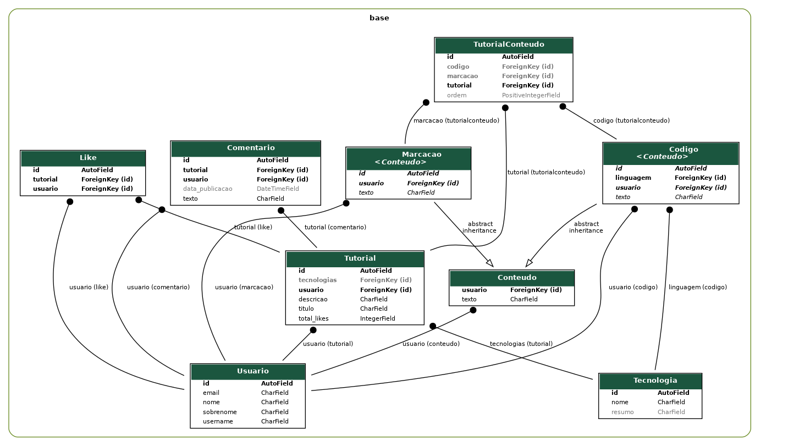

# GuiaDev

Um projeto de Programação WEB

# Ambiente (Linux)

## pip & venv

    sudo apt install python3-pip

    sudo apt install python3-venv

## Graphviz

    sudo apt install graphviz

## Ambiente virtual

    python3 -m venv .venv

    source .venv/bin/activate

## Pacotes Python

    pip install -r requirements.txt

# Aplicação

    cd guiadev

## Execução do servidor

    python3 manage.py runserver

## Habbitmq

    #Rodar arquivo rabbit.sh

        chmod +x filename.sh

        sudo ./filename.sh

    #Start server

        sudo systemctl start rabbitmq-server

    #Stop server

        sudo systemctl stop rabbitmq-server

## Rodar o projeto com docker container por container

  # Criar subnet 
  
    docker network create --subnet=172.18.0.0/16 guiadevnet 

  # Fazer build da imagem do rabbitmq

    Na pasta ./rabbitmq
    docker build -t rabbitmq . 
  # Subir container com o Rabbitmq na network criada com ip statico

    docker run --net=guiadevnet --ip=172.18.0.22 -it rabbitmq 

  # Fazer build da imagem do enviador de email

    Na pasta ./guiadev-email

    docker build -t email

  # Subir o container com o email

    docker run -it email
  
  # Fazer build da imagem do guiadev-web

    Na pasta ./guiadev
    docker build -t guidev .

    # Subir o container com a imagem guiadev mapeando a 
    porta 8080 do localhost com a porta 8000 do container

    docker run -it -p 8080:8000 guiadev
    
## Rodar o projetor com docker compose

  #Especificando o arquivo compose com -f
    docker compose -f docker-compose.yml up 

  #Utilizando o .yml no diretório local
    docker compose up
## Lista networks

  docker network ls
## Verificar info da network no docker

    docker newteork inspec [nome_network]
## Listar containes

    docker container ls
## Listat imagens

    docker images
## Deletar imagens 

    docker rmi
## Apagar cache do docker 

    docker system prune
## Comando docker para ver ip do container 

   docker inspect -f '{{range .NetworkSettings.Networks}}{{.IPAddress}}{{end}}' [CONTAINER-ID]   #Verifica ip do container

## Curiosidades sobre docker
  Arquivos .yml e .yaml tem a mesma função, é dito na internet que 
  antigos programadores não gostam de extenções com mais de 3 caracteres
  por isso não utilizam o .yaml

  o Docker é feito na linguam Go.
## Banco de dados

    python3 manage.py makemigrations

    python3 manage.py migrate

## Criação de administrador

    python3 manage.py createsuperuser

# Diagrama Relacional dos Modelos

    ./guiadev/manage.py graph_models base -g -o relational_model.png

