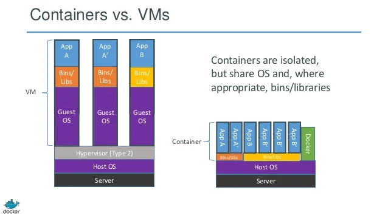
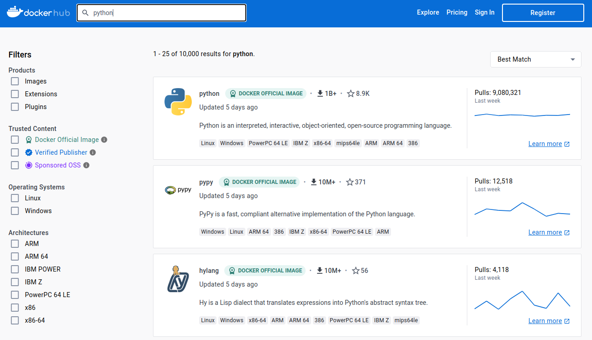
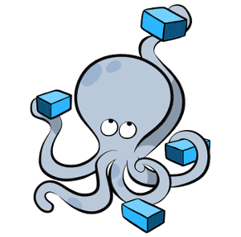

 

# GuiaDev

Um projeto de `Programação WEB`

**Professor:** Raphael Winckler De Bettio

**Alunos:**

- <a src="https://github.com/fabioVitorTavares/">Fábio Tavares</a>
- <a src="https://github.com/Victorgonl">Victor Gonçalves</a>

## Ambiente de desenvolvimento

- Sistema Operacional: Linux

## pip & venv

Certifique que os pacotes `python3-pip` e `python3-venv` estão deviamente instalados.

    sudo apt install python3-pip

    sudo apt install python3-venv

## Graphviz (para diagrama relacioanal do modelo de dados)

O pacote `graphviz` servirá para extrair o modelo relacional do banco de dados da aplicação.

    sudo apt install graphviz

## Ambiente virtual

A criação e ativação do ambiente virtual Python é feita pelo comando:

    python3 -m venv .venv

    source .venv/bin/activate

## Pacotes Python

Os pacotes `pip` estão disponíveis no arquivo `./requirements.txt` e pode ser instalado com:

    pip install -r requirements.txt

## Rabbitmq

O Sistema de Mensageria utilizado para comunicar entre a aplicação WEB `GuiaDev` e o serviço de e-mail `GuiaDev E-mail` é o `RabbitMQ`. Os comandos abaixo utilizam o script `rabbitmq.sh` para instalar o serviço. Posteriormente, susbtituímos por um `container` `Docker`.

### Instalar Rabbitmq

    cd rabbitmq

    chmod +x ./rabbitmq.sh

    sudo ./rabbitmq.sh

### Start server

    sudo systemctl start rabbitmq-server

### Stop server

    sudo systemctl stop rabbitmq-server

## GuiaDev (Aplicação WEB)

A Aplicação WEB está implementada em `./guiadev`.

A aplicação não depende do `GuiaDev E-mail` ou `RabbitMQ` para funcionar, exceto seu recurso de envio de e-mail, que utiliza o Sistema de Mensageria para enviar a mensagem para o `GuiaDev E-mail`. Mas caso um dos dois estiver indisponível, não irá afetar seu funcionamento.

    cd guiadev

### Execução

O seguinte comando inicia o servidor `Django`:

    python3 manage.py runserver

### Atualizar banco de dados

Para analisar alterações no modelo de dados e aplicar as alterações no banco de dados, utilizamos o par de comandos:

    python3 manage.py makemigrations

    python3 manage.py migrate

### Criação de administrador

Para criarmos administradores do servidor, utilizamos:

    python3 manage.py createsuperuser

### Diagrama Relacional dos Modelos

O comando a seguir atualiza a imagem do modelo de dados:

    python3 manage.py graph_models base -g -o ../relational_model.png

## GuiaDev E-mail (Serviço de E-mail)

A implementação do serviço de e-mail está disponível em `./guiadev-email`. O serviço é independente da aplicação WEB, não requerindo seu funcionamento, mas é dependendo do serviço do `RabbitMQ`.

    cd guiadev-email

### Execução

Para executar o serviço:

    python3 guiadev-email.py

# Docker

## Sobre

- Criado por **Solomon Hykes**

- Lançamento: 20 de março de 2013

- Licença `Apache 2.0`

- Implementado em `Go`

A seguir, iremos executar nossas aplicações e o `RabbitMQ` utilizando `Docker`.

## Benefícios

- Rápido (deployment, migration, restart)

- Seguro

- Leve (armazenamento e processamento)

- Código aberto

- Portátil

- Controle de versionamento

## Componentes

### cliente (Docker)

É a interface de linha de comando (CLI) que permite aos usuários interagir com o Docker.

### Daemon

É um processo em segundo plano responsável por gerenciar os containers do Docker.

### Engine

É um componente que permite criar, gerenciar e executar containers dentro do sistema operacional host.

### Machine

Permite criar hosts Docker (VMs) na máquina local, em nuvem ou data centers, criando servidores, instalando o Docker neles e, em seguida, configurando o cliente Docker para se comunicar com eles.

### Compose

É uma ferramenta para definir e executar aplicativos Docker com vários containers utilizando um arquivo YAML para configurar os serviços da aplicação.

### Swarm

É o modo nativo do Docker para gerenciar um cluster de Engines Docker chamado de swarm.

### Registry

É um sistema de armazenamento e entrega de conteúdo que armazena imagens Docker nomeadas, disponíveis em diferentes versões com tags.

## Docker VS Virtual Machines (VMs)

Containers são ferramentas de virtualização que empacotam um aplicativo e suas dependências em uma unidade isolada e leve que roda diretamente no kernel do host. São mais rápidos, eficientes e escaláveis do que VMs, pois consomem menos espaço em disco e recursos, compartilhando o mesmo sistema operacional do host.

## Image & Container

Uma imagem do Docker é um pacote leve, autônomo e executável de software que inclui tudo o que é necessário para executar um aplicativo: código, tempo de execução, ferramentas do sistema, bibliotecas do sistema e configurações

Um container é uma unidade padrão de software que empacota código e todas as suas dependências para que o aplicativo seja executado de maneira rápida e confiável em diferentes ambientes de computação

O comando `docker build` é usado para criar imagens Docker a partir de um `Dockerfile` e um “contexto”. O contexto de uma construção é o conjunto de arquivos localizados no PATH ou URL especificado. O processo de construção pode se referir a qualquer um dos arquivos no contexto1. Especificando a opção `--pull`, o Docker tentará baixar a versão mais recente da imagem base, em vez de reutilizar a que já está baixada localmente.

O comando `docker pull` é usado para baixar imagens do `Docker Hub` ou de outro repositório remoto. Ele permite que você obtenha uma imagem que já foi criada por outra pessoa ou organização, para ser usada em containers, sendo possível especificar a versão da imagem que desejada.

### Exemplo utilizando SSH

    docker pull ubuntu
    docker run -it --name ubuntu_example ubuntu /bin/bash

## Docker HUB

O Docker Hub é um serviço de repositório fornecido pelo Docker para encontrar e compartilhar imagens de containers.

## Compose

`Docker Compose` é uma ferramenta para definir e executar aplicativos Docker com vários containers. Com o Compose, é utilizado um arquivo `YAML` para configurar os serviços da aplicação e em seguida, com um único comando, é possível criar e iniciar todos os serviços a partir da configuração definida.

# Utilizando `Docker` no `GuiaDev`

## Instalação

### `Docker Engine` & `Docker Compose` Plugin

    sudo apt-get update

    sudo apt-get install ca-certificates curl gnupg

    sudo install -m 0755 -d /etc/apt/keyrings

    curl -fsSL https://download.docker.com/linux/ubuntu/gpg | sudo gpg --dearmor -o /etc/apt/keyrings/docker.gpg

    sudo chmod a+r /etc/apt/keyrings/docker.gpg

    echo \
    "deb [arch="$(dpkg --print-architecture)" signed-by=/etc/apt/keyrings/docker.gpg] https://download.docker.com/linux/ubuntu \
    "$(. /etc/os-release && echo "$VERSION_CODENAME")" stable" | \
    sudo tee /etc/apt/sources.list.d/docker.list > /dev/null

    sudo apt-get update

    sudo apt-get install docker-ce docker-ce-cli containerd.io docker-buildx-plugin docker-compose-plugin

## Criação de grupo para acessar recursos do `Docker`

Criamos o grupo de usuários `docker` se já não estiver criado e adicionamos o usuário atual `$USER`.

    sudo groupadd docker
    sudo usermod -aG docker $USER
    newgrp docker

## Criação de uma network

Iremos criar uma network exclusiva para nossas aplicações: `guiadev-network`.

    docker network create guiadev-network

Podemos verificar as networks criadas com o comando:

    docker network ls

## `Dockerfile`

Iremos definir três imagens para `GuiaDev`, `GuiaDev E-mail` e `RabbitMQ`, cada uma em seu diretório específico.

## Build

Para criarmos cada uma das imagens definidas, utilizamos:

- `GuiaDev`:

      docker build -t guiadev ./guiadev

- `GuiaDev E-mail`:

      docker build -t guiadev-email ./guiadev-email

- `RabbitMQ`:

      docker build -t guiadev-rabbitmq ./rabbitmq

## Run

Para iniciar um container para cada aplicação, utilizamos:

- `GuiaDev`:

      docker run -d --name guiadev --network=guiadev-network -p 8000:8000 guiadev

- `RabbitMQ`:

      docker run -d --name guiadev-rabbitmq --network=guiadev-network -p 5672:5672 -p 15672:15672 guiadev-rabbitmq

- `GuiaDev E-mail`:

      docker run -d --name guiadev-email --network=guiadev-network guiadev-email

É importante que o container do `RabbitMQ` seja iniciado antes do container do `GuiaDev E-mail`.

## `Docker Compose`

Podemos utilizar `docker-compose.yml` para criar as imagens e todas as aplicações utilizando:

    docker compose up -d

## Refereências

- https://github.com/theodorosploumis/docker-presentation

<!--

#

## Rodar o projeto com docker container por container

# Criar subnet

    docker network create --subnet=172.18.0.0/16 guiadevnet

# Fazer build da imagem do rabbitmq

    Na pasta ./rabbitmq
    docker build -t rabbitmq .

# Subir container com o Rabbitmq na network criada com ip statico

    docker run --net=guiadevnet --ip=172.18.0.22 -it rabbitmq

# Fazer build da imagem do enviador de email

    Na pasta ./guiadev-email

    docker build -t email

# Subir o container com o email

    docker run -it email

# Fazer build da imagem do guiadev-web

    Na pasta ./guiadev
    docker build -t guidev .

    # Subir o container com a imagem guiadev mapeando a
    porta 8080 do localhost com a porta 8000 do container

    docker run -it -p 8080:8000 guiadev

## Rodar o projetor com docker compose

    #Especificando o arquivo compose com -f
      docker compose -f docker-compose.yml up

    #Utilizando o .yml no diretório local
      docker compose up

## Listar networks

    docker network ls

## Verificar info da network no docker

    docker network inspec [nome_network]

## Listar containes

    docker container ls

## Listar imagens

    docker images

## Deletar imagens

    docker rmi

## Apagar cache do docker

    docker system prune

## Comando docker para ver ip do container

docker inspect -f '{{range .NetworkSettings.Networks}}{{.IPAddress}}{{end}}' [CONTAINER-ID] #Verifica ip do container

## Curiosidades sobre docker

É feito na linguam Go.
 -->