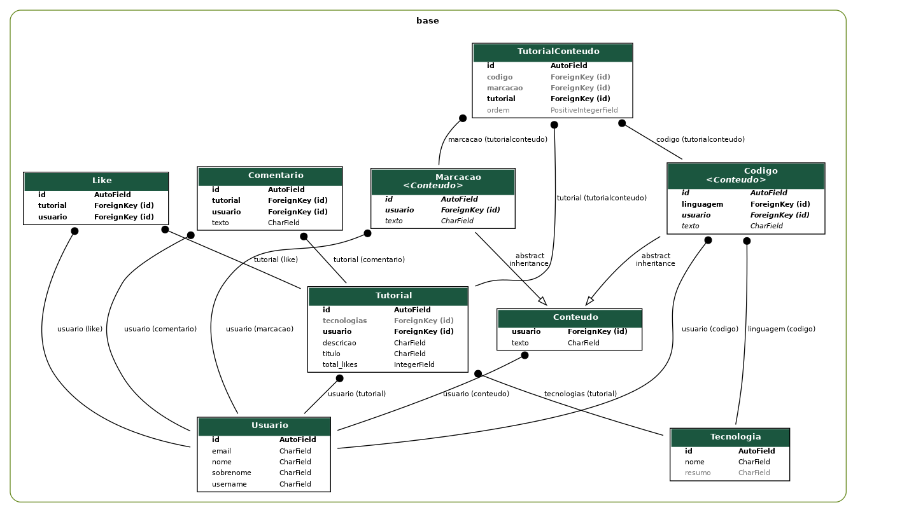

# Projeto de Programação WEB

# Ambiente (Linux)

## pip & venv

    sudo apt install python3-pip

    sudo apt install python3-venv

## Graphviz

    sudo apt install graphviz

## Ambiente virtual

    python3 -m venv .venv

    source .venv/bin/activate

## Pacotes Python

    pip install -r requirements.txt

# Aplicação

    cd src

## Execução do servidor

    python3 manage.py runserver

## Criação do banco de dados

    python3 manage.py migrate

## Atualização no banco de dados

    python3 manage.py makemigrations polls

    python3 manage.py sqlmigrate polls 0001

## Criação de administrador

    python3 manage.py createsuperuser

# Diagrama Relacional dos Modelos

    ./manage.py graph_models base -g -o relational_model.png

